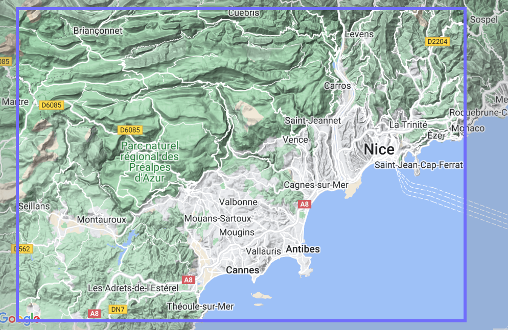
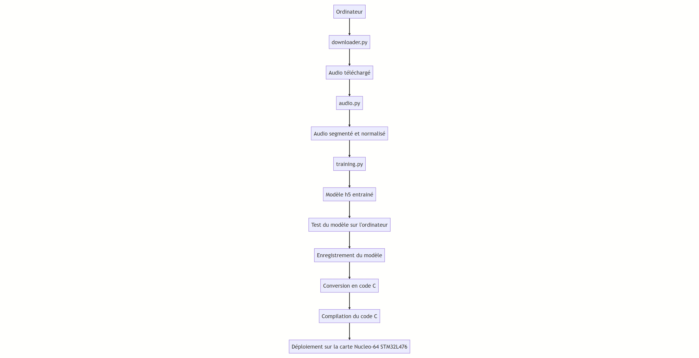

# Projet Capteur Actionneur

## Table des matières
[Description](#description)

- [Contexte](#contexte)
- [Choix des sujets](#choix-des-sujets)
- [Données du réseau de neurones](#données-du-réseau-de-neurones)
- [Objectifs](#objectifs)

[Organisation](#organisation)

[Modèle de réseau de neurones convolutif](#modèle-de-réseau-de-neurones-convolutif)

[Résultats](#résultats)


## Description
### Contexte

Nous avons choisi de nous lancer dans l’identification des chants de diverses espèces d’oiseaux. Pour cela, nous utilisons la base de données Xeno-canto, abordée lors de nos cours, qui contient un grand nombre d’enregistrements d’oiseaux variés. Ce projet est d’autant plus pertinent que notre établissement est situé près du parc naturel des Préalpes, où de nombreuses espèces d’oiseaux transitent et sont souvent difficiles à reconnaître.

### Choix des sujets



En ce qui concerne notre sélection d’espèces, nous avons décidé d’examiner les enregistrements disponibles dans un rayon d’environ 30 km autour de l’école et de retenir les espèces les plus courantes. Nous avons identifié [137 enregistrements de 43 espèces différentes](https://xeno-canto.org/explore?query=box%3A43.488%2C6.729%2C43.84%2C7.367+&dir=0&order=en) et allons nous concentrer sur les 3 espèces suivantes :

- [Sterne pierregarin · Sterna hirundo](https://xeno-canto.org/species/Sterna-hirundo) (691 enregistrements) 
- **[Pinson des arbres · Fringilla coelebs](https://xeno-canto.org/species/Fringilla-coelebs) (6049 enregistrements)**
- [Fauvette à tête noire · Sylvia atricapilla](https://xeno-canto.org/species/Sylvia-atricapilla) (4496 enregistrements)

Avec donc comme espèce principale le pinson des arbres, qui est l’espèce la plus courante autour de Valbonne, et deux autres espèces qui sont assez différentes du pinson des arbres, mais qui sont également assez courantes dans la région.

Nous avons choisi de privilégier une espèce principale pour optimiser nos efforts, améliorer la précision de l'identification, accentuer la pertinence régionale, renforcer le potentiel éducatif et développer des méthodologies spécifiques, applicables ultérieurement à d'autres espèces.

### Données du réseau de neurones

Pour chaque espèce, nous collectons 200 enregistrements (300 pour l’espèce principale) de différentes durées que nous segmentons toutes les trois secondes en format WAV, afin de normaliser au maximum les données utilisées dans le réseau de neurones. Par la suite, nous avons réparti le nombre d’enregistrements de chaque espèce en séparant la base d’apprentissage de la base de tests. Ainsi, environ 70 % des données sont dédiées à l’apprentissage et environ 30 % aux tests.

### Objectifs

Les objectifs de ce projet incluent l’identification des chants de diverses espèces d’oiseaux, en mettant l’accent sur le pinson des arbres, grâce à l’utilisation de capteurs et d’intelligence artificielle basée sur des réseaux de neurones. Le projet vise également à exploiter la base de données Xeno-canto pour entraîner et tester l’IA en segmentant et normalisant les enregistrements. En outre, il a pour but de renforcer la compréhension de la biodiversité locale et de sensibiliser le public à l’importance des oiseaux du parc naturel des Préalpes. Finalement, le projet ambitionne de développer des méthodologies d’identification automatique des espèces d’oiseaux qui pourront être appliquées à d’autres espèces à l’avenir.

## Organisation

Nous avons décidé d’utiliser notre ordinateur pour exécuter le code. Il était également possible d’opter pour Google Colab, mais cela aurait nécessité l’utilisation d’un fichier .ipynb (notebook), et nous préférons travailler avec des fichiers .py pour plus de simplicité, notamment afin de tout lancer en une seule commande.

Pour commencer, nous avons créé le fichier `downloader.py` qui permet de télécharger tous les fichiers audio. Ensuite, nous avons créé le fichier `audio.py`, qui permet de segmenter les fichiers audio en plusieurs extraits de trois secondes et de normaliser ces données. Puis, nous avons créé le fichier `training.py` pour entraîner notre réseau de neurones.

Suite à cela, nous avons élaboré un fichier main.py afin de tout lancer en une seule commande. Une fois le fichier `main.py` exécuté, il télécharge les fichiers audio, les segmente, les normalise et entraîne finalement le réseau de neurones, créant ainsi un fichier .h5 contenant le modèle entraîné.

Après avoir testé notre modèle sur notre ordinateur, nous l'avons transféré sur la carte Nucleo-64 STM32L476. Ainsi, nous avons enregistré notre modèle pour pouvoir le récupérer ultérieurement si nécessaire, avant de le convertir en code C, de le compiler et de le déployer à l’aide du logiciel Arduino IDE sur la carte.



## Modèle de réseau de neurones convolutif

Le réseau 1D-CNN est adapté pour traiter les signaux audio des bruits d'oiseaux grâce à ses couches convolutives qui extraient des caractéristiques hiérarchiques et locales. La réduction de dimensionnalité préserve les informations importantes tout en accélérant l’analyse et le modèle est facilement modifiable pour s'adapter à diverses situations. La fonction d’activation ReLU évite le problème de disparition du gradient et accélère la convergence, tandis que la couche dense et l'activation softmax permettent une classification en plusieurs catégories pour identifier différentes espèces d’oiseaux. Enfin, l’optimiseur Adam assure une convergence rapide et des performances élevées en ajustant les taux d’apprentissage, faisant de ce 1D-CNN un choix intéressant pour détecter les bruits d’oiseaux en raison de sa capacité à traiter, extraire et classifier les signaux audio.

L’objectif était de mettre en œuvre une version considérablement simplifiée du M5 présenté dans le TD5, qui est très performant, mais trop gourmand en ressources pour être utilisé sur un appareil compact comme la carte que nous utilisons.

```python
Total params: 2,395
Trainable params: 2,395
Non-trainable params: 0
```

## Résultats


```python

Epoch 1/5
36/36 [==============================] - 4s 68ms/step - loss: 0.9472 - categorical_accuracy: 0.5590 - val_loss: 0.8877 - val_categorical_accuracy: 0.5230
Epoch 2/5
36/36 [==============================] - 3s 94ms/step - loss: 0.8500 - categorical_accuracy: 0.5428 - val_loss: 0.8573 - val_categorical_accuracy: 0.5832
Epoch 3/5
36/36 [==============================] - 2s 60ms/step - loss: 0.8111 - categorical_accuracy: 0.5715 - val_loss: 0.8231 - val_categorical_accuracy: 0.5823
Epoch 4/5
36/36 [==============================] - 2s 62ms/step - loss: 0.7871 - categorical_accuracy: 0.5531 - val_loss: 0.8000 - val_categorical_accuracy: 0.5408
Epoch 5/5
36/36 [==============================] - 2s 61ms/step - loss: 0.7705 - categorical_accuracy: 0.5640 - val_loss: 0.7880 - val_categorical_accuracy: 0.5528
267/267 - 2s - loss: 0.7880 - categorical_accuracy: 0.5528 - 2s/epoch - 6ms/step
267/267 [==============================] - 2s 6ms/step

tf.Tensor([[3912   0   340][139    0   23][3310   0   801]], shape=(3, 3), dtype=int32)
```

Testing accuracy: 0.552258

